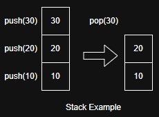
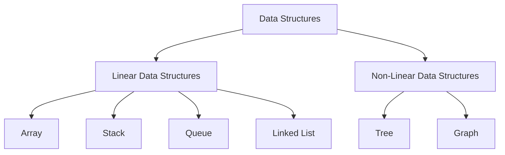
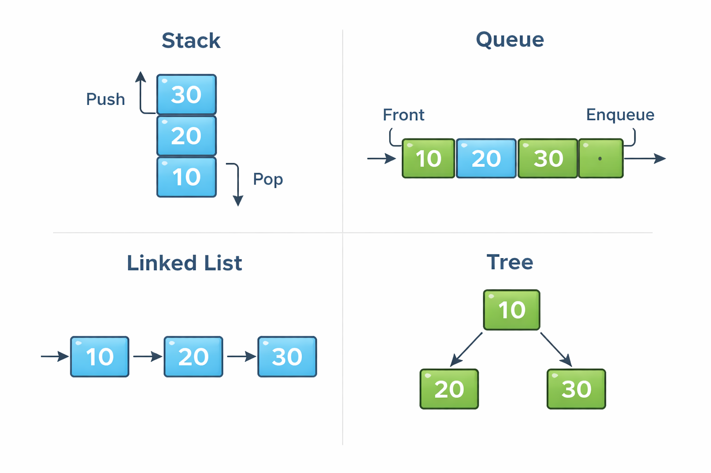

## What is Data Structure? (2 Marks)

A data structure is a way of organizing, storing, and managing data in memory so that it can be accessed and processed efficiently.

Example:
A Stack is a data structure where elements are added and removed using the LIFO (Last In, First Out) principle, like the Undo operation in MS Word, where the last action is undone first.

---

## What is ADT? (1 Mark)

ADT (Abstract Data Type) is a logical description of a data structure that defines what operations can be performed on the data, without specifying how the data is implemented.

---

## **Explain concept of ADT with suitable example** (2 Marks)

An **ADT (Abstract Data Type)** is a data type that defines **a set of operations and their behavior**, without specifying the **implementation details** of how the data is stored.

Example:
**Stack ADT** defines operations such as **push()**, **pop()**, and **peek()**, but it does not specify whether the stack is implemented using an **array or a linked list**.

---

## Explain Linear and Non-Linear Data Structures with suitable examples. (5 Marks) May2025

Linear Data Structures

Linear data structures store elements in a **sequential (linear) order**, where each element is connected to its **previous and next** element.

**Examples:**

* **Array** – Elements are stored in contiguous memory locations
* **Stack** – Follows **LIFO** (Last In, First Out) principle
* **Queue** – Follows **FIFO** (First In, First Out) principle
* **Linked List** – Each node points to the next node

**Example explanation:**
In a **Queue**, elements are inserted from the **rear** and deleted from the **front**, similar to a **ticket counter queue**.

---

Non-Linear Data Structures

Non-linear data structures store elements in a **hierarchical or interconnected manner**, where elements do not form a single sequence.

**Examples:**

* **Tree** – Hierarchical structure with parent-child relationship
* **Graph** – Nodes connected in a network form

**Example explanation:**
A **Tree** represents hierarchical data such as a **computer file system**, where folders contain subfolders and files.

---

---

---

Marks split:

* Definition + example of Linear DS – 2 marks
* Definition + example of Non-Linear DS – 2 marks
* Diagram – 1 mark

---

## Explain Static and Dynamic Data Structures with suitable examples (5 Marks)

Static Data Structures

Static data structures have a **fixed size**, and the memory is allocated **at compile time**. Once the size is defined, it **cannot be changed** during program execution.

**Examples:**

* **Array**
* **Static Stack / Static Queue (using array)**

**Example explanation:**
An **array** of size 10 will always store only 10 elements. Memory is reserved in advance, even if all elements are not used.

---

Dynamic Data Structures

Dynamic data structures do **not have a fixed size**. Memory is allocated and deallocated **at run time**, allowing the structure to grow or shrink as needed.

**Examples:**

* **Linked List**
* **Dynamic Stack / Queue (using linked list)**
* **Tree**

**Example explanation:**
In a **linked list**, nodes are created dynamically, and memory is allocated only when a new element is added.

---

Marks split:

* Static DS definition + example – 2.5 marks
* Dynamic DS definition + example – 2.5 marks

---

